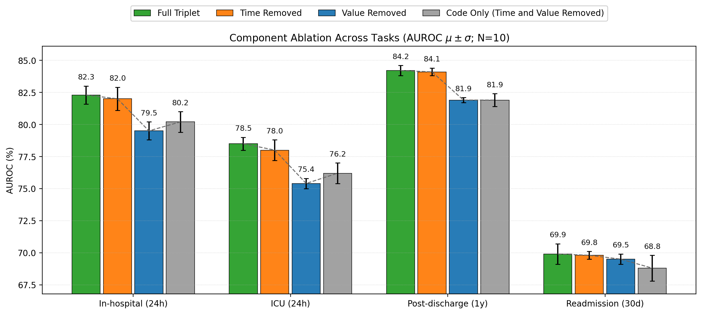
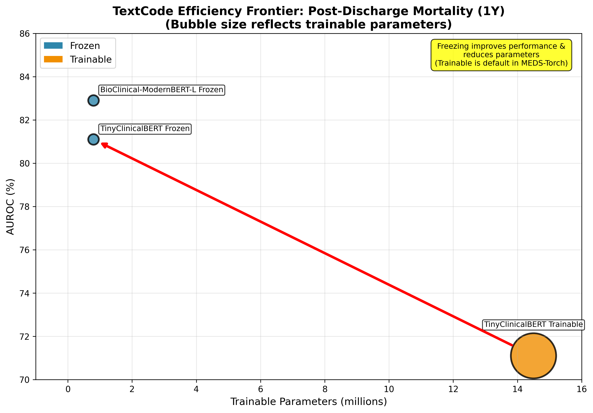

# Rethinking Tokenization for Clinical Time Series (ML4H Findings 2025)

## Acknowledgements
This repository contains the code for the experiments in our paper, "Rethinking Tokenization for Clinical Time Series: When Less is More." The codebase is adapted from the [`meds-torch` library](https://github.com/Oufattole/meds-torch). We thank the original authors for their foundational work. For the maintained, production-ready version of the library, please see the official repository.

---

## Overview
This work presents a systematic evaluation of tokenization approaches for clinical time series modeling. We compare Triplet and TextCode strategies across four prediction tasks on MIMIC-IV to investigate the roles of time, value, and code representations. Our findings suggest that for transformer-based models, tokenization can often be simplified without sacrificing performance.

## Key Findings Summary

| Component            | Finding                                                                              | Implication                                                                    |
| -------------------- | ------------------------------------------------------------------------------------ | ------------------------------------------------------------------------------ |
| **Time Features**    | Explicit time encodings showed no statistically significant benefit.                 | Sequence order in transformers may be sufficient for the tasks studied.        |
| **Value Features**   | Importance is task-dependent (critical for mortality, less so for readmission).      | Code sequences alone can carry significant predictive signal for some tasks.   |
| **Frozen Encoders**  | Tend to outperform trainable encoders with far fewer parameters.                     | Pretrained knowledge may serve as an effective regularized feature extractor.  |
| **Code Information** | Appears to be the strongest predictive signal across the experiments studied.        | Code representation quality may be a key driver of model performance.          |

<p align="center">
  
</p>

## Repository Structure

### Research Code Variants
- `triplet_encoder_time2vec.py` - Time2Vec implementation for advanced time encoding
- `triplet_encoder_lete.py` - LeTE (Learnable Time Embeddings) implementation
- `triplet_encoder_code_only.py` - Code-only ablation (no time/value features)
- `triplet_encoder_no_time.py` - No-time ablation variant
- `triplet_encoder_no_value.py` - No-value ablation variant
- `textcode_encoder_flexible.py` - Flexible TextCode encoder with trainable/frozen modes

### Experiment Scripts
- `experiment_baseline_multiseed.sh` - Baseline Triplet experiments
- `experiment_time2vec_multiseed.sh` - Time2Vec experiments
- `experiment_lete.sh` - LeTE experiments
- `experiment_code_only.sh` - Code-only ablation experiments
- `experiment_no_time.sh` - No-time ablation experiments
- `experiment_no_value.sh` - No-value ablation experiments
- `experiment_flexible_textcode.sh` - TextCode optimization experiments

## Dataset and Framework

- **Dataset**: MIMIC-IV processed into MEDS format
- **Tasks**: In-hospital mortality, ICU mortality, post-discharge mortality, 30-day readmission
- **Framework**: MEDS-Torch with transformer encoders
- **Evaluation**: AUROC with 10 random seeds, statistical significance testing

<p align="center">
  
</p>

---

*This research suggests that simpler, more parameter-efficient tokenization approaches may achieve competitive performance in clinical time series modeling, raising questions about the necessity of complex temporal encodings and highlighting the task-dependent role of value features.*

---

## Citation

If you use this code or build on this work, please cite:

```bibtex
@misc{attrach2025ehrtokenization,
  title     = {Rethinking Tokenization for Clinical Time Series: When Less is More},
  author    = {Al Attrach, Rafi and Fani, Rajna and Restrepo, David and Jia, Yugang
               and Celi, Leo Anthony and Sch\"{u}ffler, Peter},
  year      = {2025},
  note      = {Machine Learning for Health (ML4H) 2025 - Findings Track}
}
```